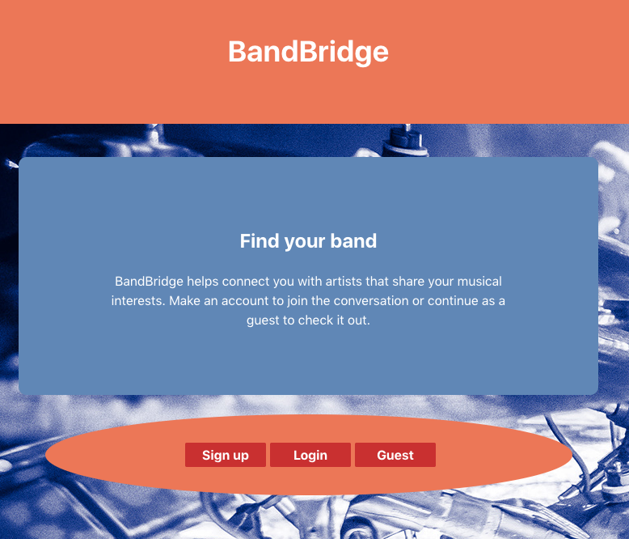
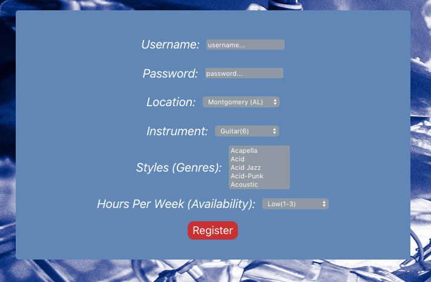
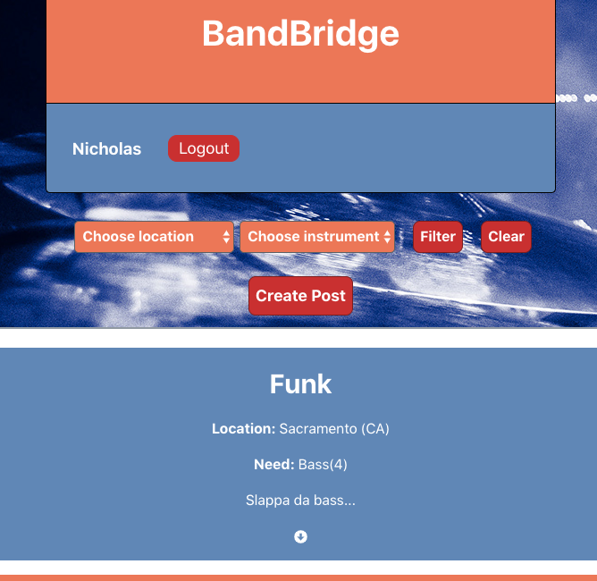
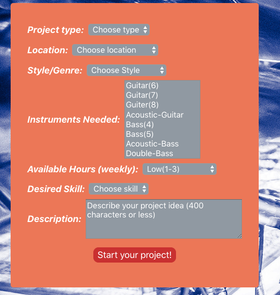
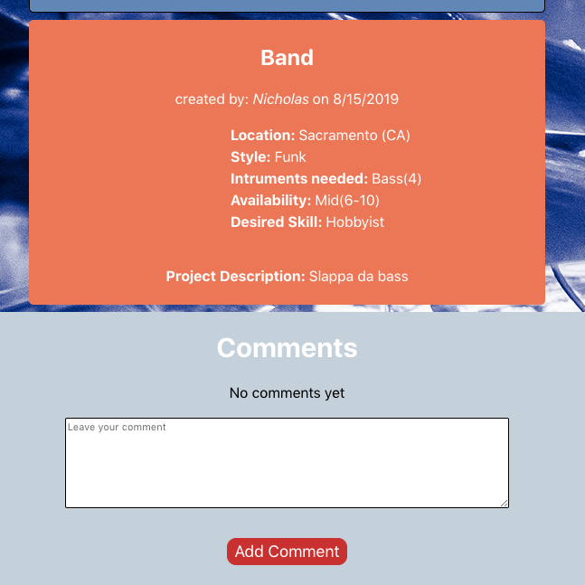

BandBridge Client
=================

> ## Summary

BandBridge connects musicians based on location, style, skill and availability. Users are able to make posts specifying their musical needs or aspirations and can filter their feed of posts to find projects and bands that they might be interested in. Users can also make comments on posts to start a conversation and hopefully start a band.

[Live App](https://band-bridge.ygnick.now.sh/)

Landing Page

Registration Page

Post List Page

Post Form Page

Post Page

Technologies used
* React
* react-dom
* react-router-dom
* jwt-decode

To run development(local) server - npm start

To deploy 
1. npm run build 
2. now ./build

